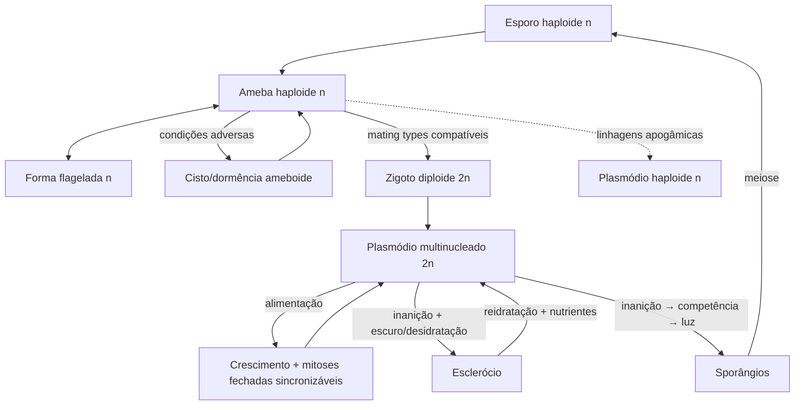
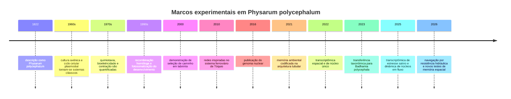

# Physarum polycephalum: biologia, genômica, fisiologia, métodos experimentais e fronteiras de pesquisa

## Resumo executivo

**Nota nomenclatural essencial.** O organismo universalmente conhecido na literatura experimental como *Physarum polycephalum* Schwein. 1822 foi transferido, com base em filogenia molecular, para **_*Badhamia polycephala*_ (Schwein.) J.M. García-Martín, J.C. Zamora & Lado, 2023**. Species Fungorum e NCBI já adotam *Badhamia polycephala* como nome corrente, mantendo *Physarum polycephalum* como basiônimo/sinônimo; o NCBI preserva o Taxonomy ID **5791**. Como praticamente toda a literatura clássica e grande parte da literatura atual continuam usando *Physarum polycephalum*, este informe emprega **P. polycephalum** como nome experimental convencional e **B. polycephala** quando a precisão taxonômica é importante. citeturn22view0turn22view1

*P. polycephalum* é um amoebozoário mixogástrio, não um fungo, cuja fase plasmodial é uma **única célula multinucleada macroscópica**, frequentemente amarela, organizada como uma rede dinâmica de tubos. Seu interesse científico é excepcional porque combina escala macroscópica, citoplasma contínuo, fluxo citoplasmático oscilatório, milhares a bilhões de núcleos dependendo do tamanho, regeneração, transições de desenvolvimento, resposta a luz e substâncias químicas e remodelação adaptativa da própria geometria. A mesma espécie permite investigar fenômenos que normalmente pertencem a campos separados: ciclo celular, mecânica ativa, sistemas de transporte, transdução de sinais, decisão sem sistema nervoso, genética de protistas, edição de RNA mitocondrial e computação morfológica. citeturn21view1turn24view3

O ciclo sexual canônico alterna **amoebas haploides → fusão → zigoto diploide → plasmódio multinucleado diploide → esporulação com meiose → esporos haploides**. Existem, porém, linhagens apogâmicas capazes de produzir plasmódios haploides sem fusão sexual, razão pela qual afirmações do tipo “o plasmódio é diploide” devem sempre ser condicionadas à linhagem. Outro aspecto incomum é que a mitose é aberta em amoebas, mas fechada no plasmódio. citeturn21view1turn10search5

O genoma nuclear de referência é grande para um protista modelo, rico em repetições e introns, com cerca de **31 mil loci gênicos** sustentados por transcriptômica; a montagem publicada está na série GenBank **ATCM00000000**, e a montagem NCBI encontra-se associada à série **GCA_000413255.x**. Uma característica quase única é a extraordinária abundância de introns do spliceossomo menor U12: foram relatados **mais de 20 mil**, cerca de 25 vezes mais que em outros genomas então conhecidos. O genoma também combina sistemas de sinalização que costumam ser associados a diferentes ramos eucarióticos, incluindo histidina-quinases de dois componentes, tirosina-quinases, GPCRs e fotossensores do tipo fitocromo, criptocromo e fototropina. citeturn21view1turn25search5turn0search11

O genoma mitocondrial, por sua vez, é circular, com **62.862 bp** na sequência clássica, e exibe uma das formas mais extraordinárias de processamento de RNA conhecidas: edição insercional cotranscricional, sobretudo adição de citidinas, mas também outras inserções. Estudos posteriores expandiram a anotação do transcriptoma mitocondrial e uma revisão de 2023 descreve, dependendo da linhagem e de elementos plasmidiais, até cerca de 81 genes/ORFs associados ao sistema mitocondrial. citeturn25search0turn25search2turn10search1

A motilidade emerge de um sistema mecanocímico. Contrações de actomiosina no córtex alteram os raios dos tubos e geram gradientes de pressão; estes produzem **shuttle streaming**, um fluxo endoplasmático que inverte periodicamente. O fluxo não é simplesmente consequência do movimento: ele transporta nutrientes, sinais e até núcleos, acoplando partes distantes da célula. Experimentos recentes mostram uma população de núcleos alternando entre estados aprisionados no córtex poroso e estados móveis advectados pelo fluxo; modelagem indica que esse mecanismo pode transportar informação muito mais rapidamente que difusão simples. citeturn2search0turn4search18turn24view3

Quimiotaxia, fototaxia e mecanossensibilidade são igualmente integradas à mecânica. Açúcares e aminoácidos podem atuar como atratores em contextos específicos; sais, alta osmolaridade e outros compostos podem ser repelentes. Cálcio e nucleotídeos cíclicos participam da transdução. A resposta luminosa é especialmente contextual: plasmodia alimentados geralmente evitam luz intensa, enquanto plasmódios previamente famintos usam luz como sinal de diferenciação e esporulação, com participação de um sistema semelhante a fitocromo e de receptores azul/UV. citeturn2search23turn2search16turn2search17turn2search22turn2search1

No laboratório, a espécie oferece dois regimes complementares. Para ensino, biofísica e redes, a cultura em **ágar não nutritivo + flocos de aveia**, no escuro e em alta umidade, é extremamente robusta. Para bioquímica, transcriptômica e genética, é preferível cultura axênica em meio solúvel; o ATCC recomenda Medium 1288 N Plus C, pH 4,6, hemina e 24–26 °C. O ATCC classifica a linhagem M3CVII como **Biosafety Level 1**. citeturn3search0turn17view0turn16view0

O ferramental molecular é desigual. **RNAi por injeção de dsRNA/siRNA está demonstrado**, assim como substituição gênica por recombinação homóloga; bulk RNA-seq, transcriptômica espacial e single-nucleus RNA-seq são factíveis e já produziram resultados importantes. Em contraste, minha busca até **19 de agosto de 2026** não encontrou uma publicação revisada por pares demonstrando um protocolo CRISPR/Cas funcional e reproduzível especificamente em *B. polycephala/P. polycephalum*. Existem projetos de desenvolvimento de transgenia/CRISPR e CRISPR já é praticável em outros amoebozoários, mas isso não deve ser confundido com uma plataforma estabelecida em *Physarum*. citeturn4search1turn4search0turn13search6turn5search16turn5search2

As afirmações populares de que o organismo “resolve labirintos”, “aprende” ou “tem memória” correspondem a fenômenos experimentais reais, mas exigem linguagem rigorosa. Ele poda redes até manter conexões eficientes, exibe habituação sob certos paradigmas e pode registrar história de nutrientes na hierarquia de diâmetros de seus tubos. Um estudo de 2026 encontrou alternância espontânea compatível com memória espacial apenas em uma escala curta de labirinto e advertiu explicitamente que efeitos topográficos ainda podem explicar o resultado. Portanto, “cognição” é um enquadramento operacional útil; **consciência, representação simbólica ou pensamento semelhante ao animal não são demonstrados**. citeturn6search0turn6search2turn6search3turn24view4

**Hipóteses adotadas para este informe:** onde o pedido não especificou linhagem, orçamento, equipamento, escala, jurisdição ou objetivo aplicado, assumi **“sem restrição”**. Protocolos abaixo são, portanto, pontos de partida de pesquisa e devem ser qualificados por linhagem, estado nutricional, ploidia, temperatura, fase da oscilação contrátil e microbiota associada. Em especial, não se deve tratar pedaços do mesmo plasmódio como réplicas biológicas independentes: eles compartilham história, citoplasma e estado fisiológico sincronizado. citeturn21view1

## Identidade biológica, taxonomia, morfologia e ciclo de vida

**Posição taxonômica.** A classificação varia ligeiramente entre bases quanto aos nomes e níveis intermediários. O NCBI situa o organismo em Eukaryota → Amoebozoa → Evosea → Eumycetozoa → Myxogastria → Myxogastromycetidae → Physariida → Physaraceae → *Badhamia*; Species Fungorum apresenta a combinação *Badhamia polycephala* e registra *Physarum polycephalum* como basiônimo. Essa transferência é suficientemente recente para que pipelines, artigos, coleções e metadados continuem misturando os dois nomes. Pesquisas bibliográficas e ômicas devem sempre usar ambos. citeturn22view0turn22view1

| Nível/atributo | Estado recomendado em 2026 | Observação prática |
|---|---|---|
| Domínio | Eukaryota | Eucarionte |
| Supergrupo | Amoebozoa | Não é fungo nem animal |
| Grupo | Eumycetozoa / Myxogastria | “Slime molds” plasmodiais |
| Ordem | Physariida/Physarales, conforme esquema | A nomenclatura de níveis intermediários não é totalmente uniforme |
| Família | Physaraceae | NCBI |
| Gênero corrente | *Badhamia* | Transferência publicada em 2023 |
| Espécie corrente | *Badhamia polycephala* | Nome aceito por Species Fungorum e NCBI |
| Basiônimo experimental | *Physarum polycephalum* Schwein., 1822 | Continua indispensável para busca bibliográfica |
| NCBI Taxonomy | 5791 | O identificador permaneceu associado à espécie após a renomeação |

Fontes taxonômicas: Species Fungorum e NCBI Taxonomy. citeturn22view0turn22view1

**Plasmódio.** É a forma mais estudada: um sincício/coenócito macroscópico delimitado por uma única membrana plasmática contínua e contendo grande número de núcleos. O corpo organiza-se em uma frente em lâmina/fan e numa rede posterior de tubos. Funcionalmente, pode-se distinguir um córtex/ectoplasma mais estrutural e contrátil e um endoplasma mais fluido, no qual ocorre grande parte do shuttle streaming. O raio dos tubos é dinâmico e constitui simultaneamente uma variável mecânica, hidráulica e informacional. citeturn2search0turn13search17turn24view3

A noção clássica de que todos os núcleos do plasmódio são equivalentes foi refinada. Transcriptômica espacial e de núcleo único demonstrou **heterogeneidade transcricional regional**, e trabalhos de 2025 mostraram que os próprios núcleos alternam entre subpopulações mecanicamente distintas — imóveis ou aprisionadas no córtex e móveis no fluxo. Assim, o plasmódio não deve ser modelado como um “saco perfeitamente misturado”. citeturn13search6turn13search18turn24view3

**Amoebas e flagelados.** Esporos germinam em células mononucleadas haploides. Em substrato úmido, as formas ameboides proliferam por mitose aberta e alimentam-se de microrganismos; em ambiente aquoso podem converter-se reversivelmente em formas flageladas, acompanhadas de grande reorganização do citoesqueleto. A existência dessas formas torna *Physarum* particularmente útil para comparar diferentes organizações de actina, microtúbulos e mecanismos mitóticos dentro do mesmo genoma. citeturn21view1

**Plasmódio versus ameba: mitose.** No plasmódio, a divisão nuclear ocorre sem citocinese, aumentando o número de núcleos enquanto a célula permanece contínua. A mitose é fechada, isto é, o envelope nuclear permanece; na ameba, a mitose é aberta. Em culturas bem alimentadas, divisões nucleares plasmodiais podem mostrar extraordinária sincronização, um dos motivos históricos para a adoção do organismo como modelo de ciclo celular. citeturn21view1

**Ploidia.** No ciclo heterotálico clássico, amoebas são **n**, a fusão entre tipos compatíveis gera um zigoto **2n**, e o plasmódio que se desenvolve desse zigoto é 2n. Durante a diferenciação em estruturas frutificantes ocorre meiose, restaurando esporos haploides. Entretanto, mutações/variantes em sistemas de mating type permitem desenvolvimento **apogâmico**, em que uma ameba forma plasmódio sem fusão; nesses casos, plasmódios podem ser haploides. Estudos citológicos clássicos também relataram aproximadamente 35–40 cromossomos em determinadas linhagens, mas essas contagens históricas não devem ser universalizadas sem reavaliação citogenômica moderna. citeturn21view1turn10search5

**Dormência.** Sob privação nutricional no escuro, o plasmódio pode entrar no estado de **esclerócio**, uma estrutura seca e resistente formada por numerosas unidades celulares/esferulares, capaz de retornar ao crescimento após reidratação. Um trabalho de 2026 investigou se a passagem pelo esclerócio impõe um estado transcricional persistente após reativação e encontrou evidências contra uma grande “memória molecular” estável desse episódio, destacando que dormência e memória comportamental são problemas distintos. citeturn3search21turn23search15

**Esporulação.** Um plasmódio nutricionalmente competente não frutifica simplesmente porque recebe luz. O modelo clássico envolve primeiro vários dias de inanição, criando competência para diferenciação, e então sinal luminoso. Protocolos modernos reproduzem alta eficiência com cerca de três dias de privação seguidos de iluminação em linhagens adequadas; transcriptômica demonstra uma ampla reprogramação de expressão durante essa transição. citeturn23search13turn14search20turn3search1

O ciclo pode ser resumido assim:

Esse diagrama representa o ciclo geral; a via apogâmica e detalhes de mating type são dependentes da linhagem. citeturn21view1turn23search13

Uma linha do tempo útil para orientar a literatura é:

Os marcos recentes correspondem à revisão taxonômica, ao genoma, aos estudos de redes/memória e aos trabalhos de 2025–2026 discutidos abaixo. citeturn21view1turn22view0turn24view0turn24view3turn21view0turn24view4

## Genética, genoma e bioquímica

**Genoma nuclear e recursos de sequência.** Schaap e colaboradores publicaram a análise do genoma em 2015/2016. A montagem é rica em repetições simples e complexas; introns têm comprimento médio de aproximadamente 100 bases, e a integração de genoma e transcriptoma permitiu definir cerca de **31.000 loci gênicos**. A sequência draft foi depositada como **ATCM00000000.3**, e o transcriptoma de referência como **GDRG00000000/GDRG01000000**. Como o NCBI vem atualizando tanto a versão da montagem quanto a taxonomia, análises reprodutíveis devem registrar accession **e versão**, não apenas “genoma de Physarum”. citeturn21view1turn25search5

Estimativas do tamanho do assembly em diferentes recursos históricos ficam aproximadamente na ordem de **~190–200 Mb**. A pequena discrepância entre números publicados não deve ser interpretada automaticamente como variação biológica: montagem, remoção de duplicações, tratamento de repetições e versão do assembly alteram o valor. citeturn12search1turn0search22

Um problema bioinformático particularmente importante são os **introns U12**. *P. polycephalum* contém mais de 20 mil introns do spliceossomo menor, número extraordinariamente elevado. Pipelines de anotação treinados principalmente em animais/fungos/planta-modelo podem, portanto, produzir erros de exonização, retenção de intron ou previsão de ORF se não tratarem adequadamente sinais U12; isso é especialmente relevante para desenho de guias, primers e peptídeos proteotípicos. citeturn0search11turn4search7

**Splicing e transcriptoma.** Estudos anteriores ao genoma já revelavam splicing alternativo substancial, e experimentos modernos demonstram remodelação extensa da expressão durante desenvolvimento, estresse e em diferentes regiões do plasmódio. Em 2025, exposição a 50 mM NaCl produziu **2.236 transcritos diferencialmente expressos** segundo os critérios do estudo — 1.027 aumentados e 1.209 reduzidos — juntamente com mudanças de arquitetura e pulsação da rede. citeturn23search3turn24view0

**Principais sistemas gênicos e moleculares.**

| Sistema/gene ou família | Evidência e função conhecida | Relevância experimental |
|---|---|---|
| **Actinas `ard`** | Estudos genéticos clássicos identificaram múltiplos loci não ligados de actina; organização e expressão variam com estágio | Motilidade, citoesqueleto, diferenciação; excelentes alvos para genética funcional citeturn25search1turn25search9 |
| **Fragmin + actin-fragmin kinase** | Fragmin regula microfilamentos; a quinase fosforila actina associada a fragmin em Thr | Controle de polimerização, esclerotização e organização de actina citeturn14search24turn25search17 |
| **Histidina-quinases/TCS** | Expansão incomum de sistemas de dois componentes; literatura genômica descreve dezenas de HKs | Sensing ambiental e desenvolvimento; grande espaço de descoberta funcional citeturn21view1turn14search1 |
| **Tirosina-quinases** | Família amplamente representada para um amoebozoário | Evidência sobre evolução antiga de sinalização Tyr em Amorphea citeturn21view1 |
| **GPCRs** | Diversidade ampla, incluindo grande grupo de receptores rhodopsin-like | Candidatos para quimiorrecepção; ligantes de muitos permanecem desconhecidos citeturn21view1 |
| **Fitocromo-like** | Fotoconversão red/far-red e controle de esporulação demonstrados | Desenvolvimento induzido por luz citeturn2search1turn2search10 |
| **Criptocromo/fototropina** | Homólogos identificados no genoma | Candidatos para UV/azul, porém mapa receptor→fenótipo ainda incompleto citeturn21view1 |
| **`lig1`/homólogo de `hus1`** | Expressão associada à transição fotomorfogenética | Liga sinal luminoso, checkpoint e desenvolvimento citeturn20search20 |
| **NOS** | Atividade/expressão de nitric-oxide synthase aumenta na esporulação; inibição precoce perturba diferenciação | NO como sinal de diferenciação citeturn3search18 |
| **Cdk/ciclinas, Cdc25, Wee1, APC, E2F/DP, Rb** | Conjunto de controle de ciclo celular relativamente elaborado preservado no genoma | Grande valor comparativo para evolução do ciclo eucariótico citeturn21view1 |
| **PPR proteins** | Família de pentatricopeptide-repeat proteins fortemente expandida | Provável importância em organelas/processamento de RNA citeturn10search0turn21view1 |
| **Glom** | Proteína de empacotamento do DNA mitocondrial | Organização de nucleoides mitocondriais citeturn25search6 |

**Genoma mitocondrial.** A sequência completa clássica é um DNA circular de **62.862 bp**, com forte viés A+T. Sua anotação é difícil porque muitas regiões codificantes não produzem RNAs funcionais diretamente a partir da sequência genômica: elas dependem de edição insercional. citeturn25search0turn25search12

O fenômeno é chamado atualmente de **mitochondrial insertional cotranscriptional RNA editing in myxomycetes**, ou MICOTREM em revisões recentes. Citidinas inseridas são o evento predominante, mas não exclusivo. O transcriptoma mitocondrial completo revelou dezenas de RNAs editados e mostrou que alguns ORFs anotados não são detectavelmente transcritos na fase plasmodial de crescimento, reforçando que “ORF no mtDNA” não equivale necessariamente a “gene expresso”. citeturn25search2turn10search1

O resultado tem uma implicação prática rara: **predizer proteína diretamente do DNA mitocondrial pode produzir uma sequência errada**. Para estudos funcionais, deve-se consultar simultaneamente DNA, RNA editado e, quando possível, evidência proteômica. citeturn25search2turn25search12

**Metabolismo.** Plasmódios axênicos crescem em meios ricos em glicose/dextrose, triptona, extrato de levedura, íons e hemina, mostrando um metabolismo heterotrófico robusto. Em vida livre, o sistema é fagotrófico/microbívoro. Respiração, glicólise, metabolismo de aminoácidos e transporte iônico são fortemente acoplados à demanda energética de crescimento e do aparato actomiosínico. A resposta transcricional a sal demonstra que homeostase iônica, proteínas de membrana, metabolismo degradativo e citoesqueleto são remodelados em conjunto. citeturn3search19turn17view0turn24view0

**β-poli(L-malato), PMLA.** Uma peculiaridade bioquímica importante é o acúmulo plasmodial de **β-poly(L-malate)**, um poliânion/poliéster que praticamente caracteriza essa fase do ciclo. O polímero acumula-se em núcleos, interage com proteínas ligantes de ácidos nucleicos, pode modular DNA-polymerase-α/primase e é posteriormente secretado/degradado. Culturas de microplasmódios foram usadas para produção de PMLA, que mais tarde se tornou uma plataforma estudada para nanoconjugados biodegradáveis. citeturn20search3turn20search14turn20search0turn20search10

**Sinalização por Ca²⁺.** A atividade do córtex de actomiosina é modulada por cálcio. Experimentos quimiotáticos clássicos mostraram que manipular Ca²⁺ pode inclusive inverter respostas comportamentais a estímulos químicos, e técnicas de microinjeção com indicadores fluorescentes permitiram visualizar dinâmica de Ca²⁺ no plasmódio. Trabalhos recentes continuam apoiando Ca²⁺ como componente central do acoplamento sinal–contração, embora uma única “via mestre” não explique todos os estímulos. citeturn2search17turn13search9turn2search14

**Nucleotídeos cíclicos.** Tanto cAMP quanto cGMP mudam em resposta a quimioestímulos; microinjeções clássicas mostraram que ambos podem provocar contração, sendo cGMP mais potente nas condições testadas. Esses resultados, juntamente com Ca²⁺ e fosforilação, indicam uma arquitetura sensorial distribuída que converte sinais externos em estado mecânico. citeturn2search16

**Fosforilação não convencional.** Estudos bioquímicos históricos de *Physarum* também chamaram atenção para fosfo-histidina e para fosforilação de actina. A fosfo-histidina é quimicamente lábil e os números quantitativos históricos devem ser reinterpretados à luz das técnicas atuais, mas o genoma confirma que sinalização por histidina não é uma curiosidade isolada: constitui uma família molecular importante do organismo. citeturn14search1turn21view1

## Fisiologia, comportamento e integração de sinais

**A unidade funcional central é o oscilador mecanohidráulico.** O córtex contém actina e miosina capazes de gerar tensão. Contrações locais alteram diâmetro e pressão nos tubos, bombeando endoplasma. Como o corpo forma uma rede interconectada, contrações de regiões separadas acoplam-se hidraulicamente e podem sincronizar ou estabelecer ondas peristálticas. citeturn2search9turn2search0turn4search18

O fluxo muda periodicamente de direção, daí o nome **shuttle streaming**. A oscilação exata depende de linhagem, temperatura, geometria, alimentação e estado fisiológico; um período da ordem de aproximadamente um a poucos minutos é típico dos experimentos clássicos e modernos, mas não deve ser usado como constante universal. No estudo de 2025 sobre movimento nuclear, por exemplo, um ciclo analisado tinha cerca de 120 s. citeturn24view3turn2search0

O movimento global é consequência de assimetria espaço-temporal. Uma onda contrátil perfeitamente simétrica deslocaria fluido para frente e para trás sem produzir avanço líquido significativo; no organismo em migração, padrões de contração, expansão da frente, adesão, fluxo e remodelação do córtex quebram essa simetria e produzem deslocamento. Medidas de forças de tração demonstram pulsos mecânicos periódicos consistentes com esse quadro. citeturn13search17turn19search8

**Transporte e comunicação de longa distância.** O mesmo fluxo que movimenta massa transporta metabólitos e sinais. Em 2025, Tong e colaboradores adicionaram um mecanismo especialmente interessante: núcleos móveis funcionariam como “mensageiros” entre populações de núcleos temporariamente aprisionadas no córtex. O modelo e os parâmetros medidos sugerem que esse sistema de “pigeon post” pode superar mecanismos puramente difusivos, em determinadas condições, por até cerca de uma ordem de grandeza e no máximo ~20 vezes nas comparações realizadas. Isso oferece uma solução física para coordenar uma célula que pode ter dimensões de centímetros. citeturn24view3

**Quimiotaxia.** Experimentos quantitativos clássicos mostraram atração por compostos como glicose, galactose, fosfatos, ATP e cAMP em determinadas condições. Outros estudos encontraram atração por aminoácidos como alanina, aspartato, asparagina, glutamato, glicina, leucina, serina e treonina, enquanto triptofano produziu resposta negativa no ensaio correspondente. Entretanto, “atrator” não é uma propriedade absoluta da molécula: concentração, osmolaridade, substrato e estado nutricional podem transformar a resposta. citeturn2search23turn2search26

Há acoplamento mensurável entre estímulo químico e tensão contrátil. Em experimentos clássicos, alguns atratores reduziram a amplitude da tensão isométrica, ao passo que repelentes e condições hiperosmóticas alteraram a contração na direção oposta. Variações de Ca²⁺ podem inverter o sinal da resposta. Portanto, um ensaio moderno de quimiotaxia não deveria medir apenas “qual braço foi escolhido”: velocidade, dinâmica de contração, osmolaridade e concentração local são variáveis mecanísticas essenciais. citeturn2search11turn2search17

**Fototaxia versus fotomorfogênese.** O comportamento diante de luz não é binário. Ensaios clássicos mostraram que baixa irradiância pode produzir orientação diferente daquela obtida em alta irradiância; UV/azul exerce influência particularmente forte sobre motilidade. Ao mesmo tempo, plasmódios famintos usam luz como gatilho para diferenciação reprodutiva. A literatura genética e espectroscópica sustenta um fotossistema complexo que inclui um receptor semelhante a fitocromo e, pelo genoma, criptocromo e fototropina. citeturn19search1turn2search22turn2search1turn2search10turn21view1

**Mecanossensibilidade e confinamento.** Um resultado de grande importância em 2026 veio de dispositivos microfluídicos bifurcados. Quando comprimento geométrico e resistência hidráulica foram dissociados, *Physarum* preferiu consistentemente o caminho de **menor resistência hidráulica**, mesmo quando esse caminho era geometricamente mais longo. Além disso, maior confinamento alterou o regime locomotor de crescimento sustentado para um padrão intermitente semelhante a “run-and-tumble”. Isso desafia a interpretação simplista de que o organismo “procura sempre o caminho mais curto”: o custo hidráulico é uma variável física independente. citeturn21view0

**Estresse osmótico/salino.** Em 2025 foram testados 0, 25, 50 e 75 mM NaCl. O aumento de sal alterou crescimento, diâmetro dos tubos e frequência de pulsação; RNA-seq a 50 mM revelou mais de dois mil DEGs, incluindo aumento de componentes de transporte iônico, membrana e defesa e redução de vários processos degradativos. Esse experimento é um bom exemplo de integração multiescala: ambiente → expressão gênica → córtex/membrana → fluxo → arquitetura. citeturn24view0

**“Memória”.** Existem pelo menos três conceitos experimentais diferentes que frequentemente são misturados. Primeiro, Boisseau e colaboradores demonstraram **habituação**: resposta reduzida a um estímulo aversivo após exposições repetidas, com recuperação posterior. Segundo, Kramar e Alim mostraram que a presença passada de nutrientes pode ficar codificada transitoriamente na **hierarquia de diâmetros dos tubos**; o corpo é, nesse caso, o suporte da memória. Terceiro, estudos de navegação investigam memória espacial, um fenômeno ainda menos estabelecido. citeturn6search2turn6search3

O experimento de 2026 com 1.274 plasmódios clonais é particularmente instrutivo: alternância espontânea significativa apareceu no labirinto com distância curta de 3 mm, mas não nas distâncias de 7 ou 14 mm nem no desenho de duas curvas após correção estatística. Os próprios autores ressaltam que ainda não está resolvido se o resultado reflete memória propriamente dita ou efeitos da topografia. É, portanto, um contraexemplo útil à tendência de superinterpretar todo comportamento adaptativo como cognição complexa. citeturn24view4

## Ecologia, cultivo e protocolos laboratoriais

Na natureza, mixogástrios ocupam principalmente microhabitats úmidos ricos em matéria orgânica, incluindo madeira em decomposição, casca e serapilheira, onde formas ameboides e plasmodiais interagem com bactérias e outros microrganismos. Registros ecológicos baseados em corpos frutíferos subestimam as fases vegetativas invisíveis; portanto, mapas de “ocorrência da espécie” são também mapas da detectabilidade da esporulação. Revisões ecológicas recentes destacam possíveis contribuições de mixomicetos às redes microbianas e à decomposição de detritos. citeturn15search0turn15search8turn15search31

A amplitude ecológica pode ser maior que a caricatura “toco úmido de floresta”. Em 2025 foi publicado um registro de *B. polycephala* desenvolvendo-se sobre biofilmes bacterianos em um sistema doméstico de drenagem, demonstrando que microhabitats antropogênicos úmidos também podem sustentar a espécie. citeturn15search1turn23search6

**Comparação prática de sistemas de cultura:**

| Sistema | Formulação/condição | Temperatura | Vantagens | Limitações |
|---|---|---:|---|---|
| Ágar + aveia, protocolo didático | Ágar 1%; flocos de aveia; alta umidade; escuro | ~22 °C | Simples, barato, ótimo para comportamento e imagem | Não axênico; composição nutricional variável citeturn3search0 |
| Ágar + aveia, variante experimental | Ágar não nutritivo 2%; 200–400 mg de aveia/dia | 28 ± 2 °C | Crescimento rápido; usado em ensaios aplicados | Temperatura e regime nutricional diferentes dificultam comparação entre laboratórios citeturn3search17 |
| ATCC 1288 N Plus C | Meio definido abaixo + hemina; ágar opcional | 24–26 °C | Cultura axênica, bioquímica e ômicas | Mais trabalhoso; requer controle de esterilidade citeturn17view0turn16view0 |
| Meio Daniel–Rusch clássico | ~1% triptona, 1% glicose, 0,15% extrato de levedura, CaCO₃/sais e suplementos da formulação original | Dependente do protocolo | Histórico para macro- e microplasmódios | Algumas formulações antigas usavam suplementos hoje inconvenientes citeturn3search19 |
| Suspensão de microplasmódios | Meio axênico líquido, aeróbio | ~24–26 °C como ponto inicial | Biomassa homogênea, bioquímica, extração, PMLA | Sensível a aeração/agitação e estado fisiológico citeturn0search10turn20search0 |

**Protocolo de rotina: plasmódio em ágar e aveia.** O protocolo abaixo segue de perto métodos publicados para cultivo robusto em laboratório. citeturn3search0

1. Prepare placas com **ágar 1% em água**, sem nutrientes adicionais. Esterilize e deixe solidificar.
2. Inocule aproximadamente **1 cm²** de um plasmódio saudável ou fragmento de cultura ativa.
3. Disponha inicialmente alguns flocos de aveia esterilizados/comercialmente limpos a pequena distância da inoculação. Em cultura de rotina, uma recomendação publicada é manter cerca de **10–12 flocos** disponíveis.
4. Incube a aproximadamente **22 °C**, no **escuro**, com umidade relativa próxima de **90%**. Evite condensação em gotas diretamente sobre o plasmódio.
5. Após aproximadamente **dois dias**, confirme colonização dos flocos e expansão radial.
6. Reponha aveia fresca aproximadamente a cada **dois dias**. Uma placa pode ficar amplamente colonizada em torno de **cinco dias**, dependendo da área, quantidade de alimento e condição do inóculo.
7. Para manutenção, recorte ~1 cm² da **frente ativa**, não uma região velha e vacuolizada, e transfira para placa nova.
8. Mantenha linhagens-mãe separadas das placas experimentais. Um experimento comportamental deve começar a partir de plasmodia com idade nutricional padronizada.

Os valores de temperatura não são universais: outros laboratórios utilizam 28 ± 2 °C e ágar 2%. A recomendação para um novo programa é escolher um regime e **não misturar dados obtidos em 22 °C e 28 °C sem tratá-los como condições experimentais diferentes**. citeturn3search0turn3search17

**Protocolo axênico ATCC Medium 1288 N Plus C.** A formulação oficial por litro é: ácido cítrico monoidratado 4,04 g; FeCl₃·4H₂O 0,06 g; MgSO₄·7H₂O 0,60 g; CaCl₂·2H₂O 0,60 g; ZnSO₄·7H₂O 0,034 g; Bacto Tryptone 10,0 g; dextrose 10,0 g; extrato de levedura 1,5 g; KH₂PO₄ 2,0 g; água deionizada até 1 L; para meio sólido, ágar 15,0 g/L. Ajusta-se para **pH 4,6 com KOH** e autoclavagem a **121 °C por 15 min**. citeturn17view0turn18view0

Prepare separadamente solução de hemina contendo **250 mg hemina + 1,0 g NaOH em 100 mL de água deionizada**, também autoclavada a 121 °C/15 min. Antes da inoculação, adicione **0,1 mL dessa solução de hemina por 100 mL de meio**. A cultura ATCC é mantida aerobiamente a **24–26 °C**; a página da linhagem informa 24 °C como ótimo de crescimento. citeturn17view0turn16view0

Para recuperar material criopreservado ATCC, a orientação da coleção é descongelamento rápido em aproximadamente **55 °C por ~1,5 min**, sem agitação agressiva, limpeza externa do recipiente com etanol 70% e inoculação de pelo menos ~50 μL — ou alguns fragmentos de material, dependendo da apresentação — no meio recomendado. Crescimento visível pode levar **6–10 dias** durante recuperação. Esses parâmetros são específicos da apresentação ATCC e não devem ser generalizados automaticamente para criopreservação desenvolvida localmente. citeturn16view0

**Protocolo para indução de esporulação.**

1. Expanda um plasmódio saudável até possuir biomassa suficiente.
2. Remova/cesse a oferta de alimento e transfira para condição não nutritiva padronizada.
3. Mantenha aproximadamente **três dias em privação**, tempo usado com alta eficiência em protocolos modernos de *P. polycephalum*.
4. Após a aquisição de competência, aplique o estímulo luminoso do protocolo escolhido; luz visível pode atuar como gatilho de comprometimento com a esporulação.
5. Mantenha um controle igualmente faminto que não receba o estímulo luminoso.
6. Registre tempo até mudança morfológica, produção de esporângios e fração efetivamente esporulada.
7. Para transcriptômica, colete pontos antes da fome, durante aquisição de competência, imediatamente após o sinal e durante diferenciação; não compare apenas “vegetativo” contra “esporulado”, pois isso mistura diversas transições. citeturn23search13turn14search20turn20search7

O requisito “fome + luz” é fortemente estabelecido para *P. polycephalum*, mas não é universal entre mixogástrios. Um estudo de 2025 mostrou perda desse gatilho em espécies relacionadas, o que torna o sistema valioso para evolução comparativa de fotomorfogênese. citeturn23search13

**Protocolo conceitual para esclerotização.** Retire alimento, mantenha o plasmódio no escuro e permita progressiva redução de água até formação de unidades secas de esclerócio. Para reativar, reidrate em ágar úmido e forneça alimento fresco. Como tempo, umidade final e velocidade de secagem variam muito entre linhagens e laboratórios, esses parâmetros devem ser tratados como variáveis experimentais e não como “receita universal”. Para estudos epigenéticos ou de memória, inclua controles pareados que passaram o mesmo tempo em cultura sem atravessar o estado de esclerócio. citeturn3search21turn23search15

**Controle de qualidade de uma cultura de pesquisa.** Uma cultura operacional deve ter: identificação de linhagem e origem; registro do regime de ploidia/apogamia; temperatura e meio fixos; número aproximado de passagens; histórico de dormência; ausência de contaminantes visíveis em cultura axênica; e um “master stock” separado das linhas submetidas continuamente a seleção experimental. Para experimentos de longa duração, deriva fenotípica por seleção de laboratório deve ser considerada uma variável, não ruído.

**Biossegurança.** A linhagem M3CVII do ATCC está classificada como **BSL-1**, consistente com uso de bancada de baixo risco. Isso não torna qualquer amostra ambiental equivalente a uma cultura BSL-1 pura: isolados silvestres podem carregar bactérias, fungos, ácaros ou outros organismos. Culturas ambientais devem ser tratadas inicialmente como consórcios desconhecidos até caracterização. citeturn16view0

Em um programa institucional, use jaleco/luvas conforme procedimento local, técnica asséptica para axênicos e ciclos de autoclave validados para descarte biológico. Não libere linhagens cultivadas, selecionadas ou geneticamente modificadas no ambiente. O risco ético direto para animais/humanos é baixo no trabalho convencional, mas há questões de **biossegurança ambiental**, coleta legal de amostras, rastreabilidade de material biológico e comunicação responsável de resultados de “cognição”.

## Técnicas experimentais e desenho de um programa de pesquisa

A característica que torna *Physarum* extraordinário — ser uma célula enorme e multinucleada — também invalida algumas convenções experimentais. O primeiro princípio é definir **qual unidade é uma réplica**. Fragmentos cortados do mesmo plasmódio mantêm propriedades sincronizadas e história compartilhada; são excelentes controles internos, mas não substituem replicação biológica independente. citeturn21view1

| Técnica | Estado em *P. polycephalum* | Medida principal | Ponto crítico |
|---|---|---|---|
| Bright-field/phase contrast time-lapse | Muito madura | Área, frente, tubos, velocidade | Luz de aquisição pode ser estímulo |
| PIV/velocimetria | Madura | Campo de fluxo endoplasmático | Separar fluxo de movimento do tubo |
| Fluorescência de actina | Demonstrada | Citoesqueleto | Introdução de sonda pode perturbar mecânica citeturn13search29 |
| Ca²⁺ imaging | Demonstrada | Ondas/dinâmica de Ca²⁺ | Calibração e fototoxicidade citeturn13search9 |
| Traction-force microscopy | Demonstrada | Força sobre substrato | Rigidez do substrato muda comportamento citeturn13search17 |
| Microfluídica | Em forte expansão | Confinamento, escolha, hidráulica | A resistência, não só comprimento, é variável causal citeturn21view0 |
| Impedance tomography | Prova de conceito | Propriedades elétricas espaciais | Reconstrução inversa/regularização citeturn19search6 |
| RNAi | Estabelecido por microinjeção | Knock-down funcional | Doses e duração são alvo-específicos citeturn4search1 |
| Recombinação homóloga | Demonstrada | Substituição gênica | Trabalho e seleção maiores que em modelos genéticos modernos citeturn4search0 |
| CRISPR/Cas | **Não estabelecido em publicação revisada por pares encontrada até 19/08/2026** | — | Não assumir transferência direta de *Dictyostelium* citeturn5search16turn5search2 |
| Bulk RNA-seq | Madura | Expressão média | Mistura regiões/núcleos heterogêneos citeturn23search3turn24view0 |
| Spatial/snRNA-seq | Demonstrada | Heterogeneidade nuclear/regional | Isolamento e anotação de estados citeturn13search6turn13search18 |
| LC-MS/MS proteômica | Tecnicamente viável, menos padronizada | Proteínas/PTMs | Annotation e U12/editing complicam busca |
| Metabolômica | Demonstrada em estudos específicos | Metabólitos/resposta | Forte dependência de meio e estado |

**Microscopia de campo claro — protocolo mínimo recomendado.**

1. Transfira um fragmento de frente ativa para uma placa fina de ágar sem nutrientes com uma fonte de alimento padronizada.
2. Deixe adaptar até que uma frente nova esteja claramente estabelecida.
3. Use iluminação mínima necessária; mantenha espectro, intensidade e duty cycle idênticos entre condições, porque a luz é biologicamente ativa.
4. Para morfologia/migração, imagens a cada **1–5 min** são um ponto de partida razoável. Para capturar oscilações contráteis de ~1–3 min, adquira muito mais rapidamente, por exemplo a cada **1–10 s**, ajustando à hipótese.
5. Extraia máscaras binárias, área, perímetro, velocidade da frente, comprimento total de rede, distribuição de diâmetro, graus dos nós e ciclos.
6. Registre simultaneamente temperatura. Uma variação térmica aparentemente pequena pode alterar cinética e período oscilatório.
7. Antes de estímulo, adquira pelo menos vários ciclos de contração como baseline.

Os intervalos de aquisição acima são recomendações de desenho experimental derivadas da escala temporal conhecida do sistema, não “valores fisiológicos universais”. Estudos recentes de fluxo chegam a acompanhar a rede inteira e mostram que medir apenas um único tubo pode perder modos globais. citeturn23search26turn24view3

**Fluxo citoplasmático.** Para PIV, capture partículas/estruturas endoplasmáticas rastreáveis ou introduza traçadores previamente demonstrados como inertes para seu ensaio. Obtenha velocidade longitudinal e perfil transversal; sincronize isso com medida de raio do tubo. Em tubos suficientemente regulares, o perfil pode aproximar fluxo de pressão do tipo Poiseuille, mas a parede não é um tubo rígido: é ativa, porosa e contrátil. No trabalho de 2025 com núcleos, os dados foram melhor descritos incluindo velocidade de slip na interface entre região fluida e córtex poroso. citeturn24view3turn2search0

**Ca²⁺ e citoesqueleto.** Indicadores fluorescentes conjugados a dextrano foram introduzidos por microinjeção e empregados para visualizar dinâmica de cálcio. A estratégia é preferível a simplesmente adicionar corante ao meio quando permeabilidade é incerta. Idealmente, registre simultaneamente fluorescência, diâmetro tubular e fluxo, pois a interpretação mecanística exige estabelecer defasagem entre Ca²⁺ e contração. citeturn13search9turn2search14

**Microfluídica.** Para novos trabalhos, não construa apenas um labirinto “curto versus longo”. O resultado de 2026 mostra que comprimento, seção transversal e resistência hidráulica precisam ser manipulados independentemente. Um desenho ideal usa bifurcações em que um ramo é mais longo porém hidraulicamente menos resistivo e outro mais curto porém mais resistivo; assim é possível discriminar geometria visual de custo de transporte. citeturn21view0

Um programa microfluídico rigoroso deve registrar pelo menos largura/altura do canal, comprimento, material, molhabilidade, geometria de entrada, disponibilidade de alimento, gradiente químico, pressão/umidade e resistência hidráulica calculada. Use chips sem estímulo químico assimétrico como controle e troque aleatoriamente esquerda/direita para excluir viés de fabricação.

**RNAi.** Haindl e Holler exploraram uma vantagem singular da célula gigante: dsRNA ou siRNA pode ser **injetado diretamente no plasmódio multinucleado**, permitindo silenciamento sem precisar transfectar individualmente milhões de células. citeturn4search1turn20search23

Um workflow moderno seria:

1. selecione uma região do mRNA sem homologia significativa com outros loci;
2. produza pelo menos dois reagentes independentes para o mesmo gene;
3. inclua dsRNA/siRNA scrambled e injeção sham;
4. injete em plasmódios fisiologicamente comparáveis;
5. faça uma curva piloto de quantidade, pois **não existe dose universal** para todos os alvos;
6. quantifique knock-down por RT-qPCR e, preferencialmente, proteína;
7. meça fenótipo em série temporal;
8. faça rescue quando geneticamente possível ou use um segundo reagente independente para reforçar causalidade;
9. para fenótipos mecânicos, registre fase da contração antes e depois da injeção.

**Recombinação homóloga.** Substituição gênica homóloga está demonstrada desde os anos 1990 e foi capaz de produzir alterações estáveis através de crescimento, desenvolvimento e meiose. Isso prova que engenharia dirigida do genoma é biologicamente possível; a limitação atual é principalmente ferramental e de eficiência, não um princípio de inviabilidade. citeturn4search0

**CRISPR/Cas: recomendação para um programa de desenvolvimento.** Como não encontrei até a data de corte um método publicado e validado especificamente para *Physarum*, um laboratório que deseje estabelecê-lo deveria tratar o projeto como desenvolvimento de tecnologia. A sequência lógica seria primeiro demonstrar expressão nuclear de uma proteína repórter, depois entrega/localização nuclear de Cas, expressão ou entrega de sgRNA, ensaio de corte num locus dispensável e só então otimizar HDR/NHEJ. Sistemas de outros amoebozoários podem orientar o desenho, mas não constituem validação. citeturn5search16turn5search2

O maior desafio conceitual para edição do plasmódio é a **multinucleação**: editar alguns núcleos não significa converter a célula inteira em uma população nuclear geneticamente homogênea. Portanto, enriquecimento/seleção e passagem por estágios unicelulares ou genética de amoebas provavelmente serão centrais num pipeline robusto.

**Bulk RNA-seq.** Para desenvolvimento ou estresse, use no mínimo estados fisiológicos rigorosamente definidos, replicação biológica independente, coleta no mesmo intervalo do ciclo de crescimento e extração rápida. Evite interpretar cada transcript como gene independente sem reconciliação com loci e splicing, devido à complexidade intrônica. O estudo de estresse salino de 2025 é um bom modelo de integração fenótipo–transcriptoma. citeturn24view0turn21view1

**Single-nucleus e transcriptômica espacial.** Essa é provavelmente uma das direções metodológicas de maior retorno. O plasmódio é uma célula, mas seus núcleos não são transcricionalmente idênticos. Portanto, um bulk RNA-seq de uma rede inteira responde “qual é a média?”, enquanto snRNA-seq responde “quais estados nucleares coexistem?” e amostragem espacial responde “onde estão?”. citeturn13search6turn13search18

Um desenho particularmente poderoso seria combinar: vídeo de fluxo → mapa de tubos → fixação/congelamento rápido → microdissecção por regiões → RNA-seq espacial/snRNA-seq → reconstrução de estado mecânico prévio. Isso permitiria testar diretamente se história de fluxo e posição geram estados transcricionais locais.

**Proteômica.** O caminho recomendável é LC-MS/MS shotgun com banco de busca construído a partir da versão exata do genoma mais transcriptos confirmados. Inclua isoformas relevantes e, para proteínas mitocondriais, sequências **após edição de RNA**. Faça FDR em nível de PSM/peptídeo/proteína e priorize quantificação label-free ou TMT conforme escala. Dada a riqueza de fosforilação e o papel de actomiosina, fosfoproteômica — incluindo estratégias compatíveis com fosfo-histidina se esse for o alvo — é uma fronteira particularmente interessante. A própria publicação do genoma foi apresentada como base para análises proteômicas quantitativas mais robustas. citeturn21view1turn25search2

**Desenho de um “core” experimental de alto nível.** Para iniciar um programa, eu priorizaria uma plataforma única que registre simultaneamente morfologia, fluxo e estado molecular. O conjunto mínimo de infraestrutura seria microscopia time-lapse automatizada com controle ambiental, bancada de cultivo axênico, microinjeção, fabricação ou acesso a microfluídica, RNA-seq terceirizado ou interno, RT-qPCR e análise computacional de imagens/redes. Proteômica e single-nucleus podem ser inicialmente colaborativas.

## Aplicações, modelos e resultados notáveis

O resultado que tornou *Physarum* mundialmente conhecido foi o experimento de Nakagaki e colaboradores em 2000. Ao ocupar inicialmente um labirinto e receber alimento em posições determinadas, o plasmódio retirou biomassa de trajetórias redundantes até manter uma conexão eficiente entre os recursos. A formulação popular “o slime mold resolve o labirinto” é aceitável como abreviação, mas biologicamente o processo é **crescimento distribuído + fluxo + reforço/pruning de tubos**, não execução simbólica de um algoritmo de busca. citeturn6search0turn6search12

Em 2010, Tero e colaboradores compararam redes produzidas pelo organismo em uma configuração espacial inspirada na região metropolitana de Tóquio com a rede ferroviária real. As redes biológicas mostraram compromissos entre eficiência de transporte, custo e tolerância a falhas, e o estudo derivou regras adaptativas suficientemente gerais para inspirar design de redes artificiais. citeturn6search5turn21view1

**Modelo de Tero.** Uma abstração padrão trata cada tubo \(ij\) como uma aresta de comprimento \(L_{ij}\), condutância efetiva \(D_{ij}\) e fluxo

\[
Q_{ij}=\frac{D_{ij}}{L_{ij}}(p_i-p_j),
\]

sujeito à conservação de fluxo nos nós. A adaptação pode ser escrita genericamente como

\[
\frac{dD_{ij}}{dt}=f(|Q_{ij}|)-\mu D_{ij},
\]

isto é, fluxo elevado reforça uma aresta e ausência de fluxo permite sua regressão. A função exata \(f\), interpretação de \(D\) e parâmetros variam entre versões; o valor conceitual é transformar uma rede inicialmente redundante em rede eficiente por **feedback local fluxo–condutância**. citeturn6search17

Esse modelo é excelente para otimização, mas não é uma descrição completa do organismo. Em um tubo real, raio, elasticidade, contração ativa, Ca²⁺, viscosidade, adesão e metabolismo estão acoplados; além disso, o fluxo é oscilatório. Modelos mecanísticos modernos precisam incorporar essa dinâmica ativa. citeturn2search0turn4search18

Uma classe mais física pode ser esquematizada por conservação de massa e transporte advectivo-difusivo de um sinal \(c\):

\[
\partial_t c+\mathbf u\cdot\nabla c
=D_c\nabla^2c+R(c,\mathrm{Ca}^{2+},\ldots),
\]

com \(\mathbf u\) produzido por gradientes de pressão e contração ativa. Se o sinal aumenta localmente a contratilidade e o fluxo transporta o próprio sinal, obtém-se um laço de feedback que pode coordenar redes extensas. Experimentos de fluxo e sinalização sustentam esse tipo de interpretação. citeturn7search16turn2search0

**Computação morfológica.** A ideia mais profunda não é que o plasmódio “simule um computador”, mas que a própria geometria física armazena e processa informação. O diâmetro de cada tubo contém informação sobre fluxo passado; essa geometria altera fluxos futuros; os fluxos alteram crescimento; o crescimento altera geometria. Em 2021, foi demonstrado experimentalmente que encontros anteriores com nutrientes deixam um traço na arquitetura tubular que influencia comportamento posterior. citeturn6search3

| Aplicação | Base biológica | Estado real | Limitação dominante |
|---|---|---|---|
| Labirintos/path finding | Pruning e reforço hidráulico | Demonstração robusta | Lento e dependente da geometria citeturn6search0 |
| Otimização de redes | Feedback fluxo–condutância | Forte como inspiração algorítmica | Modelo abstrato ≠ organismo completo citeturn6search5turn6search17 |
| Lógica biológica | Crescimento, fluxo, estímulo mecânico/químico | Provas de conceito XOR/NOR e outras | Velocidade, variabilidade, integração citeturn19search1turn19search9 |
| Sensoriamento químico | Quimiotaxia/bioeletricidade | Provas de conceito | Especificidade e calibração citeturn15search30turn23search32 |
| Microfluídica ativa | Tubos como rede de transporte | Área experimental ativa | Escala e controle de fronteiras citeturn21view0 |
| Robótica bioinspirada | Regras descentralizadas de adaptação | Algoritmos modernos funcionais | Geralmente não contém tecido vivo citeturn23search17 |
| Robótica bio-híbrida | Oscilações/sinais do plasmódio | Provas de conceito | Robustez, interface eletrônica, manutenção |
| Materiais/PMLA | β-poly(L-malate) biossintético | Plataforma polimérica/nanomedicina experimental | Purificação, escala, consistência citeturn20search0turn20search10 |
| Educação | Crescimento visível, baixo risco | Muito madura | Contaminação e excesso de antropomorfismo citeturn3search0turn16view0 |

**Lógica e computação não convencional.** Tubos plasmodiais foram usados como elementos de portas lógicas baseadas em fluxo e estímulo mecânico, incluindo implementações experimentais de XOR e NOR; revisões de computação com slime mold catalogam circuitos, sensores e processadores experimentais. Isso demonstra computação física, mas ainda está muito distante de competir com eletrônica convencional em velocidade, densidade ou reprodutibilidade. citeturn19search1turn19search9

**Robótica.** A área deve ser dividida em duas categorias. Sistemas **bio-híbridos** conectam o organismo vivo diretamente a sensores/atuadores; sistemas **bioinspirados** apenas transferem regras de *Physarum* para software. Um trabalho recente sobre redes mesh descentralizadas multi-robô mostrou ganhos de desempenho com algoritmo inspirado em *Physarum*, mas o “slime mold” nessa aplicação é a regra matemática, não o substrato computacional físico. citeturn23search17

**Materiais.** A contribuição material mais concreta é o PMLA. O polímero produzido e secretado por microplasmódios pode ser isolado e funcionalizado quimicamente. Trabalhos biomédicos exploraram seus grupos carboxila como plataforma de conjugação para moléculas de targeting, oligonucleotídeos e outros módulos. Isso é uma aplicação de um produto bioquímico de *Physarum*, não uma “estrutura viva auto-reparável” no sentido usado por parte da literatura especulativa de materiais vivos. citeturn20search0turn20search10turn20search13

**Educação.** Poucos organismos mostram, a olho nu e em poucos dias, quimiotaxia, dinâmica de rede, oscilação, otimização, crescimento e diferenciação. Protocolos modernos de ensino usam ágar e aveia e permitem converter uma experiência acessível em treinamento quantitativo de image analysis, desenho experimental e estatística. O principal cuidado pedagógico é separar observação — “a rede se reorganizou” — de inferência antropomórfica — “ele pensou”. citeturn3search0

**Resultado de 2026: resistência hidráulica.** A descoberta de que *Physarum* pode escolher um caminho geometricamente mais longo se ele oferecer menor resistência hidráulica é especialmente importante para computação bioinspirada: sugere que a função objetivo biologicamente relevante não é simplesmente distância euclidiana, mas custo de transporte sob restrições físicas. citeturn21view0

**Resultado de 2025: coordenação nuclear.** A descoberta das populações nuclear móvel e aprisionada acrescenta uma camada que modelos puramente geométricos ignoram. A célula não só “calcula” através dos tubos; elementos que controlam sua expressão gênica são fisicamente transportados pela mesma rede. Isso liga mecânica, transporte e genômica em um único sistema. citeturn24view3

**Resultado de 2025: resposta transcricional à mecânica ambiental.** O experimento de sal demonstrou que alterar condições externas muda simultaneamente arquitetura tubular, pulsação e milhares de transcritos. Essa observação enfraquece modelos em que adaptação de rede é tratada como pura hidráulica passiva: o organismo modifica ativamente sua fisiologia molecular. citeturn24view0

## Controvérsias, lacunas, futuro, plano de estudo e bibliografia

**A taxonomia ainda “quebrou” a literatura.** A transferência para *Badhamia polycephala* é recente, enquanto seis décadas de biologia experimental usam *Physarum*. NCBI e Species Fungorum já fizeram a mudança, mas muitos artigos novos ainda usam o nome antigo por continuidade. Um programa sério deve manter um thesaurus que associe `Badhamia polycephala`, `Physarum polycephalum`, TaxID 5791 e os accessions históricos. citeturn22view0turn22view1

**O genoma de referência não é um “genoma terminado” no sentido dos modelos mais maduros.** A montagem histórica é draft, altamente repetitiva, a anotação enfrenta dezenas de milhares de introns U12 e a literatura de genética clássica usa nomenclaturas de loci anteriores à genômica moderna. Um **assembly cromossômico telômero-a-telômero com long reads + Hi-C**, complementado por Iso-Seq e proteômica, provavelmente teria retorno científico excepcional. citeturn21view1turn0search11turn25search5

**Ploidia e heterogeneidade precisam voltar ao centro.** O paradigma “plasmódio diploide, núcleos sincronizados” continua útil, mas esconde linhagens apogâmicas, heterogeneidade transcricional e estados nucleares mecanicamente distintos. Uma das maiores oportunidades é fazer genotipagem single-nucleus e transcriptômica single-nucleus ao longo do ciclo, perguntando se núcleos individuais divergem geneticamente, epigeneticamente ou apenas transcricionalmente. citeturn21view1turn13search6turn24view3

**CRISPR é uma lacuna metodológica de primeira ordem.** RNAi e recombinação homóloga provaram que genética funcional é possível; o que falta é um sistema rotineiro, eficiente, multiplexável e bem documentado. Uma plataforma CRISPR teria impacto imediato sobre fotossensoriamento, histidina-quinases, controle do fluxo, ciclo celular, edição mitocondrial e desenvolvimento. Até a data de corte deste informe, não encontrei demonstração revisada por pares de CRISPR funcional em *P. polycephalum/B. polycephala*. citeturn4search0turn4search1turn5search16

**O receptor de muitos estímulos continua desconhecido.** A fisiologia clássica descreve quimiotaxia com enorme riqueza, e o genoma contém muitos receptores candidatos, mas para grande parte dos ligantes ainda não existe cadeia causal receptor → segundo mensageiro → Ca²⁺/córtex → fluxo → orientação. A combinação de RNAi/edição futura, microfluídica quantitativa e calcium imaging é uma estratégia direta para fechar essa lacuna. citeturn2search23turn21view1turn13search9

**A mecânica precisa ser ligada diretamente à expressão gênica.** O trabalho de estresse salino mostra correlação multiescala, e a transcriptômica espacial mostra heterogeneidade; o próximo passo é perturbar tensão/fluxo sem alterar diretamente química e medir, no mesmo indivíduo, consequência transcriptômica local. citeturn24view0turn13search6

**O mecanismo da “memória” não é único.** Habituação, memória estrutural dos tubos e alternância espacial provavelmente não são manifestações de um mesmo mecanismo molecular. O erro conceitual seria procurar “o gene da memória de Physarum”. Uma agenda mais produtiva é perguntar qual variável física ou molecular armazena informação em cada paradigma e qual seu tempo de relaxamento. citeturn6search2turn6search3turn24view4

**“Inteligência” é uma controvérsia principalmente semântica e mecanística.** Há comportamento adaptativo real, integração distribuída e memória operacional em paradigmas específicos. Não há evidência de neurônios, cérebro ou representações simbólicas equivalentes às de animais. A interpretação mais conservadora é **cognição basal/morfológica** como linguagem operacional, não uma afirmação sobre consciência. O resultado negativo/parcial do ensaio de memória espacial de 2026 ilustra por que controles físicos precisam acompanhar a terminologia cognitiva. citeturn24view4turn6search14

**Questões abertas de alta prioridade:**

1. Qual é o assembly nuclear cromossômico verdadeiro e quanta variação estrutural existe entre linhagens de laboratório?
2. Quantos estados nucleares estáveis existem dentro de um único plasmódio, e eles correspondem a posições, idades, fluxo ou destinos celulares?
3. Como Ca²⁺, nucleotídeos cíclicos, actomiosina e pressão formam o oscilador contrátil completo?
4. Quais GPCRs/sensores reconhecem cada quimioatrator ou repelente clássico?
5. Como os sinais de luz azul/UV e vermelho/vermelho-distante convergem para a decisão irreversível de esporulação?
6. Qual maquinaria molecular determina os pontos e nucleotídeos da edição insercional mitocondrial?
7. Como núcleos móveis e aprisionados trocam informação e expressão ao longo de muitas horas?
8. É possível estabelecer CRISPR multiplex e gerar populações nucleares homogeneamente editadas?
9. Até que ponto a memória arquitetural de tubos explica habituação e outros paradigmas comportamentais?
10. Qual função objetivo física o organismo realmente otimiza: dissipação, eficiência hidráulica, risco, cobertura, aquisição de nutrientes ou uma combinação variável? O resultado de 2026 mostra que “menor distância” isoladamente é insuficiente. citeturn21view0turn24view3turn6search3

**Prioridades para um novo programa de pesquisa.** Eu atribuiria prioridade máxima a quatro frentes integradas: genoma cromossômico/epigenoma; plataforma de perturbação genética; imageamento simultâneo de Ca²⁺–fluxo–força; e transcriptômica espacial/single-nucleus. Elas transformariam o campo de uma coleção de fenômenos fascinantes numa biologia causal multiescala.

**Plano de formação de aproximadamente seis meses.**

| Período | Objetivo | Produto mínimo |
|---|---|---|
| Semanas 1–2 | Taxonomia, ciclo, literatura clássica | Mapa conceitual do ciclo; thesaurus *Physarum/Badhamia* |
| Semanas 3–4 | Cultivo em aveia e cultura axênica | Linhagem estável, SOP de manutenção |
| Semanas 5–6 | Time-lapse e análise de rede | Pipeline reprodutível de segmentação |
| Semanas 7–8 | Fluxo e contração | PIV + série temporal de diâmetro |
| Semanas 9–10 | Quimiotaxia e fototaxia | Ensaios dose–resposta controlados |
| Semanas 11–12 | Desenvolvimento | Esporulação e esclerotização reproduzíveis |
| Semanas 13–14 | Genoma/transcriptoma | Ambiente bioinformático com assembly e RNA-seq |
| Semanas 15–16 | RNAi | Knock-down de alvo positivo/controle |
| Semanas 17–18 | Microfluídica | Bifurcação distância × resistência |
| Semanas 19–20 | Mecânica/Ca²⁺ | Dataset sincronizado fluxo–contração–sinal |
| Semanas 21–22 | Ômicas espaciais | Piloto de regiões ou núcleos |
| Semanas 23–24 | Projeto independente | Pergunta causal, pré-registro e pipeline completo |

As primeiras leituras deveriam ser o artigo de genoma de Schaap et al.; a literatura de fluxo/biomecânica de Alim e colaboradores; a revisão/modelagem de redes de Tero; os trabalhos de habituação e memória arquitetural; a transcriptômica espacial; e os estudos de 2025–2026 sobre núcleos, sal e confinamento. citeturn21view1turn2search0turn6search17turn6search2turn6search3turn24view3turn24view0turn21view0

**Bibliografia essencial e bases de dados.** A seleção abaixo prioriza trabalhos primários e recursos que servem como pontos de entrada para montar um programa de pesquisa.

- **Taxonomia corrente:** Species Fungorum, *Badhamia polycephala*. [Species Fungorum record 846262](https://www.speciesfungorum.org/Names/NamesRecord.asp?RecordID=846262). NCBI Taxonomy: [TaxID 5791](https://www.ncbi.nlm.nih.gov/Taxonomy/Browser/wwwtax.cgi?id=5791). citeturn22view0turn22view1
- **Schaap P. et al.** *The Physarum polycephalum Genome Reveals Extensive Use of Prokaryotic Two-Component and Metazoan-Type Tyrosine Kinase Signaling*. Genome Biology and Evolution 8:109–125. DOI [10.1093/gbe/evv237](https://doi.org/10.1093/gbe/evv237). GenBank nuclear: **ATCM00000000.3**; transcriptoma: **GDRG01000000**. citeturn21view1turn25search5
- **NCBI Genome/Datasets:** [busca por TaxID 5791](https://www.ncbi.nlm.nih.gov/datasets/genome/?taxon=5791). A montagem encontra-se na série **GCA_000413255.x**; registrar a versão usada em cada análise. citeturn22view2turn25search13
- **Takano H. et al.** *The complete DNA sequence of the mitochondrial genome of Physarum polycephalum*. Molecular Genetics and Genomics 264:539–545. Genoma mitocondrial de 62.862 bp; sequência histórica associada a **AB027295**. [PubMed](https://pubmed.ncbi.nlm.nih.gov/11212908/). citeturn25search0turn25search10
- **Bundschuh R. et al.** *Complete characterization of the edited transcriptome of the mitochondrion of Physarum polycephalum*. Nucleic Acids Research 39:6044–6055. [Artigo](https://academic.oup.com/nar/article/39/14/6044/1377140). citeturn25search2
- **Glöckner G. et al.** *Transcriptome reprogramming during developmental switching in Physarum polycephalum*. Scientific Reports, 2017. [Artigo](https://www.nature.com/articles/s41598-017-12250-5). citeturn23search3
- **Barrantes I. et al.** *Transcriptomic changes arising during light-induced sporulation in Physarum polycephalum*. BMC Genomics 11:115. [DOI/full text](https://doi.org/10.1186/1471-2164-11-115). citeturn20search7turn25search9
- **Gerber T. et al.**, estudo de transcriptômica espacial/single-nucleus em plasmódios, eLife, 2022; demonstrou heterogeneidade regional e nuclear. citeturn13search6turn13search18
- **Haindl M., Holler E.** *Use of the giant multinucleate plasmodium of Physarum polycephalum to study RNA interference*. 2005. [PubMed](https://pubmed.ncbi.nlm.nih.gov/15922285/). citeturn20search23
- **Gene replacement por recombinação homóloga**, trabalho de 1995, demonstra alteração estável de locus em *Physarum*. citeturn4search0
- **Nakagaki T., Yamada H., Tóth Á.** *Intelligence: Maze-solving by an amoeboid organism*. Nature 407, 470, 2000. Referência fundadora da literatura de path finding. citeturn6search0
- **Tero A. et al.** *Rules for Biologically Inspired Adaptive Network Design*. Science 327:439–442, 2010. Referência central para redes adaptativas. citeturn6search5
- **Tero A., Kobayashi R., Nakagaki T.** Modelo matemático de adaptação de rede, Journal of Theoretical Biology, 2007. Referência para a dinâmica \(dD/dt=f(Q)-\mu D\). citeturn6search17
- **Alim K. et al.** *Random network peristalsis in Physarum polycephalum organizes fluid flows across an individual*. PNAS, 2013. Base moderna da visão hidráulica/peristáltica. citeturn2search0
- **Oettmeier C., Brix K., Döbereiner H.-G.** revisão de *Physarum* como sistema de mecânica celular e fluxo, J. Phys. D, 2017. citeturn4search18
- **Boisseau R.P., Vogel D., Dussutour A.** estudo de habituação em *P. polycephalum*, Proceedings of the Royal Society B, 2016. citeturn6search2
- **Kramar M., Alim K.** estudo de memória codificada na arquitetura de tubos, PNAS, 2021. citeturn6search3
- **Tong J. et al.** *Coexistence of trapped and flow-transported nuclei enables fast pigeon post communication across multinucleated cell*. PNAS 122:e2411101122, 2025. DOI [10.1073/pnas.2411101122](https://doi.org/10.1073/pnas.2411101122). citeturn24view3
- **Sánchez-Parra B. et al.** *Salt affects structure, function and transcriptome in the giant cells of slime molds*. Scientific Reports, 2025. DOI [10.1038/s41598-025-29951-x](https://doi.org/10.1038/s41598-025-29951-x). citeturn24view0
- **Kharal S.P. et al.** *Confinement and hydraulic resistance appear to separately govern motility and path selection in Physarum polycephalum*. Journal of the Royal Society Interface 23:20250873, 2026. DOI [10.1098/rsif.2025.0873](https://doi.org/10.1098/rsif.2025.0873). citeturn21view0
- **Kuttner L., Freiberg J.** *Inducing chirality in slime mold—spontaneous alternation behavior may reveal spatial memory in Physarum polycephalum*. Protist 181:126156, 2026. DOI [10.1016/j.protis.2026.126156](https://doi.org/10.1016/j.protis.2026.126156). citeturn24view4
- **ATCC Medium 1288 N Plus C:** formula oficial de cultura axênica. [ATCC PDF](https://www.atcc.org/-/media/product-assets/documents/microbial-media-formulations/1/2/8/8/atcc-medium-1288.pdf). citeturn17view0
- **PMLA:** Lee et al., *Beta-poly(L-malate) production by non-growing microplasmodia of Physarum polycephalum*, 2000; e literatura de nanoconjugados baseada no polímero. [PubMed](https://pubmed.ncbi.nlm.nih.gov/11094281/). citeturn20search0turn20search10
- **UniProt:** taxon atualizado sob [*Badhamia polycephala*, TaxID 5791](https://www.uniprot.org/taxonomy/5791), útil para reconciliar nomes e proteínas históricas. citeturn20search12
- **PubMed:** para monitoramento contínuo, a consulta deve combinar `"Physarum polycephalum" OR "Badhamia polycephala"`; a diferença nomenclatural é suficientemente recente para que uma busca com apenas um dos nomes perca literatura relevante. A necessidade dessa consulta dupla decorre da mudança de nome já implementada nas bases taxonômicas. citeturn22view0turn22view1

O quadro atual é, portanto, incomum: *P. polycephalum* é simultaneamente um **modelo clássico**, com literatura fisiológica de mais de meio século, e um **modelo molecular subdesenvolvido** em comparação com levedura, *Dictyostelium*, *Drosophila* ou *C. elegans*. É precisamente essa combinação que o torna estrategicamente atraente em 2026. Os fenômenos de maior interesse — fluxo ativo, multicompartmentalização sem membranas internas entre regiões, transporte de núcleos, memória morfológica e diferenciação coordenada — já são experimentalmente acessíveis; o que ainda falta é ligar esses fenômenos de forma causal a genes, proteínas, segundos mensageiros e estados nucleares. Um programa que combine genômica moderna, edição genética, microfluídica e física quantitativa teria espaço real para descobertas fundamentais. citeturn21view1turn24view3turn21view0